# Camera Management Example App Service
Use the Camera Management Example application service to auto discover and connect to nearby ONVIF and USB based cameras. This application will also control cameras via commands, create inference pipelines for the camera video streams and publish inference results to MQTT broker.

This app uses [EdgeX compose][edgex-compose], [Edgex Onvif Camera device service][device-onvif-camera], 
[Edgex USB Camera device service][device-usb-camera], [Edgex MQTT device service][device-mqtt] and [Edge Video Analytics Microservice][evam].

A brief video demonstration of building and using the example app service can be found [here](https://www.youtube.com/watch?v=vZqd3j2Zn2Y).

## Install Dependencies

### Environment
This example has been tested with a relatively modern Linux environment - Ubuntu 20.04 and later

### Install Docker
Install Docker from the official repository as documented on the [Docker](https://docs.docker.com/engine/install/ubuntu/) site.

### Configure Docker
To enable running Docker commands without the preface of sudo, add the user to the Docker group.

> **Warning**  
> The docker group grants root-level privileges to the user. For details on how this impacts security in your system, 
> see [Docker Daemon Attack Surface](https://docs.docker.com/engine/security/#docker-daemon-attack-surface).

1. Create Docker group:
   ```bash
   sudo groupadd docker
   ```
   > **Note**: If the group already exists, `groupadd` outputs a message: **groupadd: group `docker` already exists**. This is OK.

2. Add User to group:
   ```bash
   sudo usermod -aG docker $USER
   ```

3. Restart your computer for the changes to take effect.

### Verify Docker
To verify the Docker installation, run `hello-world`:

```bash
docker run hello-world
```
A **Hello from Docker!** greeting indicates successful installation.

```bash
Unable to find image 'hello-world:latest' locally
latest: Pulling from library/hello-world
2db29710123e: Pull complete 
Digest: sha256:10d7d58d5ebd2a652f4d93fdd86da8f265f5318c6a73cc5b6a9798ff6d2b2e67
Status: Downloaded newer image for hello-world:latest

Hello from Docker!
This message shows that your installation appears to be working correctly.
...
```

### Install Docker Compose
Install Docker Compose from the official repository as documented on the [Docker Compose](https://docs.docker.com/compose/install/linux/#install-using-the-repository) site.

### Install Golang
Install Golang from the official [Golang](https://go.dev/doc/install) website.

### Install Tools
Install build tools:

```bash
sudo apt install build-essential
```

## Steps for running this example:

### 1. Start the EdgeX Core Services and Device Services.

1. Clone `edgex-compose` from github.com.
   ```shell 
   git clone https://github.com/edgexfoundry/edgex-compose.git
   ```  

2. Navigate to the `edgex-compose` directory:

   ```bash
   cd edgex-compose
   ```

3. Checkout the latest compatible release branch
   > **Note**: The `levski` branch is the latest stable branch at the time of this writing.
   ```shell
   git checkout levski
   ```

4. Navigate to the `compose-builder` subdirectory:

   ```bash
   cd compose-builder/
   ```

5. (Optional) Update the `add-device-usb-camera.yml` file:
   > **Note**: This step is only required if you plan on using USB cameras.

   a. Add the rtsp server hostname environment variable to the `device-usb-camera` service, 
      where `your-local-ip-address` is the ip address of the machine running the `device-usb-camera` service.
   ```yml
   services:
      device-usb-camera:
             environment:
               DRIVER_RTSPSERVERHOSTNAME: "your-local-ip-address"
   ```

   b. Under the `ports` section, find the entry for port 8554 and change the host_ip from `127.0.0.1` to either `0.0.0.0` or the ip address you put in the previous step.

6. Run the following `make` command to generate the edgex core services along with MQTT, Onvif and Usb device services.

  > **Note**: The `ds-onvif-camera` parameter can be omitted if no Onvif cameras are present, or the `ds-usb-camera` parameter can be omitted if no usb cameras are present.
```shell
   make gen no-secty ds-mqtt mqtt-broker ds-onvif-camera ds-usb-camera 
```   

7. Configure [device-mqtt] service to send [Edge Video Analytics Microservice][evam] inference results into Edgex via MQTT

      a. Copy the entire [evam-mqtt-edgex](edge-video-analytics/evam-mqtt-edgex) folder into `edgex-compose/compose-builder` directory.

      b. Copy and paste [docker-compose.override.yml](edge-video-analytics/evam-mqtt-edgex/docker-compose.override.yml) from the above copied folder into edgex-compose/compose-builder directory.
         Insert full path of `edgex-compose/compose-builder` directory under volumes in this `docker-compose.override.yml`.
   > **Note**: Please note that both the services in this file need the full path to be inserted for their volumes.
   
8. Run the following command to start all the Edgex services.
```shell
   docker compose -f docker-compose.yml -f docker-compose.override.yml up -d
```  

### 2. Start [Edge Video Analytics Microservice][evam] running for inference.

> **Note**: The port for EVAM result streams has been changed from 8554 to 8555 to avoid conflicts with the device-usb-camera service.

```shell
# Go back to the root of this example app
cd edgex-examples/application-services/custom/camera-management

# Run this once to download edge-video-analytics into the edge-video-analytics sub-folder, 
# download models, and patch pipelines
make install-edge-video-analytics

# Run the EVAM services (in another terminal)
make run-edge-video-analytics
# ...
# Leave this running
```

> **Note**: If you press `Ctrl-C` it will stop the EVAM services. If you then run `make stop-edge-video-analytics`,
> it will also remove the containers and free up the port mappings.

### 3. Build and run the example application service

#### 3.1 (Optional) Configure Onvif Camera Credentials.
   > **Note**: This step is only required if you have Onvif cameras. Currently, this example app is limited to supporting
   > only 1 username/password combination for all Onvif cameras.

   > **Note**: Please follow the instructions for the [Edgex Onvif Camera device service][device-onvif-manage] in order to connect your Onvif cameras to EdgeX.

   Option 1: Modify the [res/configuration.toml](res/configuration.toml) file

   ```toml
   [Writable.InsecureSecrets.CameraCredentials]
   path = "CameraCredentials"
     [Writable.InsecureSecrets.CameraCredentials.Secrets]
     username = "<username>"
     password = "<password>"
   ```

   Option 2: Export environment variable overrides
   ```shell
   export WRITABLE_INSECURESECRETS_CAMERACREDENTIALS_SECRETS_USERNAME="<username>"
   export WRITABLE_INSECURESECRETS_CAMERACREDENTIALS_SECRETS_PASSWORD="<password>"
   ```  

#### 3.2 Build and run
```shell
# First make sure you are at the root of this example app
cd edgex-examples/application-services/custom/camera-management
```

```shell
# Build the app. 
make build-app

# Run the app.
make run-app
```

## Using the App

1. Visit https://localhost:59750 to access the app.

  
<p align="left">
<i>Figure 1: Homepage for the Camera Management app</i>
</p>

### Camera Position

You can control the position of supported cameras using ptz commands.

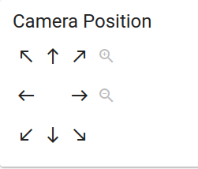  

1. Use the arrows to control the direction of the camera movement.
1. Use the magnifying glass icons to control the camera zoom.

### Start an Edge Video Analytics Pipeline

This section outlines how to start an analytics pipeline for inferencing on a specific camera stream.

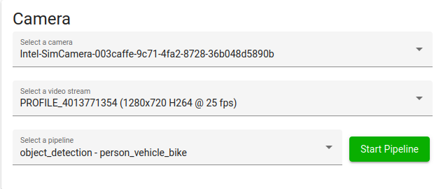  

1. Select a camera out of the drop down list of connected cameras.  
   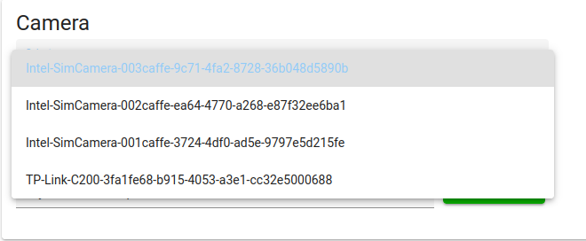  

1. Select a video stream out of the drop down list of connected cameras.  
   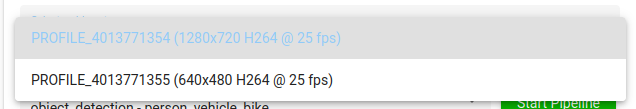  

1. Select a analytics pipeline out of the drop down list of connected cameras.  
   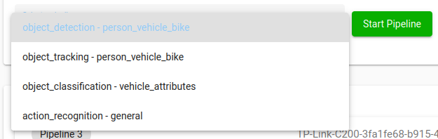  

1. Click the `Start Pipeline` button.


### Running Pipelines

Once the pipeline is running, you can view the pipeline and its status.

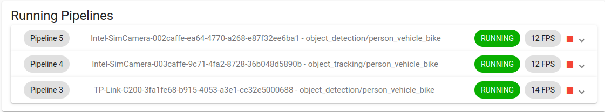  

1. Expand a pipeline to see its status. This includes important information aush as elapsed time, latency, frames per second, and elapsed time.  
   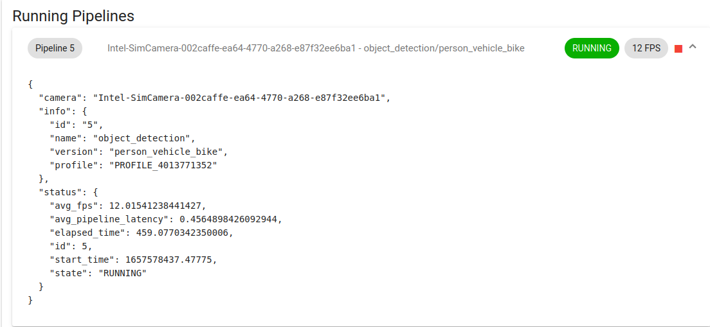  

1. In the terminal where you started the app, once the pipeline is started, this log message will pop up.
    ```bash
    level=INFO ts=2022-07-11T22:26:11.581149638Z app=app-camera-management source=evam.go:115 msg="View inference results at 'rtsp://<SYSTEM_IP_ADDRESS>:8555/<device name>'"
    ```

1. Use the URI from the log to view the camera footage with analytics overlayed.
    ```bash
    ffplay 'rtsp://<SYSTEM_IP_ADDRESS>:8555/<device name>'
    ```

   Example Output:  
   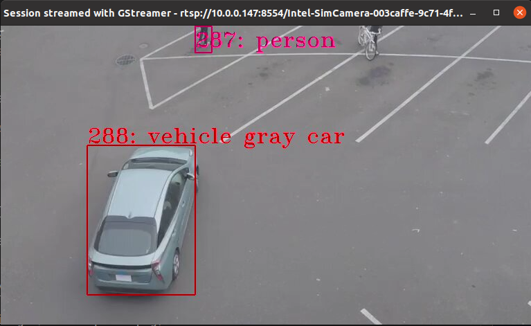  

1. Press the red square stop button to shut down the pipeline.


### API Log

The API log shows the status of the 5 most recent calls and commands that the management has made. This includes important information from the responses, including camera information or error messages.

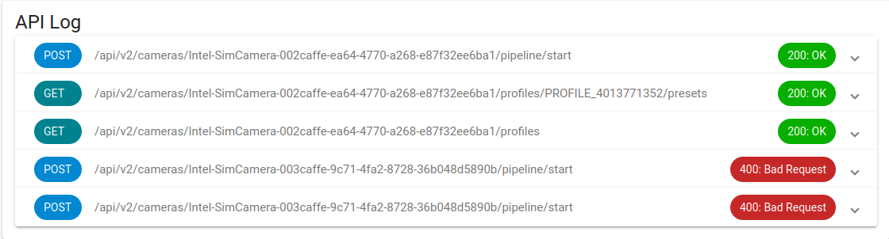  

1. Expand a log item to see the response

   Good response:
   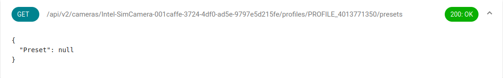  
   Bad response:
   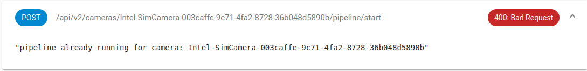  

### Inference Events

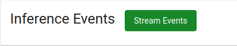  

1. To view the inference events in a json format, click the `Stream Events` button.

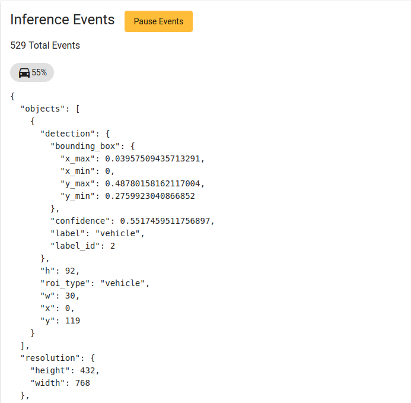  

### Inference results in Edgex

To view inference results in Edgex, open Edgex UI [http://localhost:4000](http://localhost:4000), click on the `DataCenter`
tab and view data streaming under `Event Data Stream`by clicking on the `Start` button.

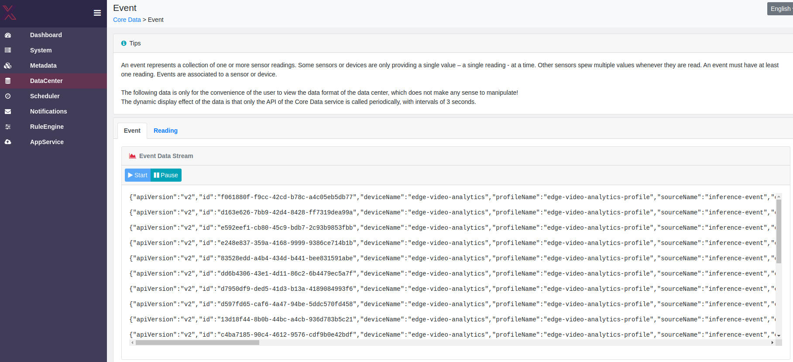

### Next steps
A custom app service can be used to analyze this inference data and take action based on the analysis.

## Additional Development

> **Warning**: The following steps are only useful for developers who wish to make modifications to the code
> and the Web-UI.

#### Development and Testing of UI
##### 1. Build the production web-ui
This builds the web ui into the `web-ui/dist` folder, which is what is served by the app service on port 59750.
```shell
make web-ui
```

##### 2. Serve the Web-UI in hot-reload mode
This will serve the web ui in hot reload mode on port 4200 which will recompile and update anytime you make changes to a file. It is useful for
rapidly testing changes to the UI.
```shell
make serve-ui
```

Open your browser to [http://localhost:4200](http://localhost:4200)


[edgex-compose]: https://github.com/edgexfoundry/edgex-compose
[device-onvif-camera]: https://github.com/edgexfoundry/device-onvif-camera
[device-onvif-manage]: https://github.com/edgexfoundry/device-onvif-camera/blob/levski/doc/guides/SimpleStartupGuide.md#manage-devices
[device-usb-camera]: https://github.com/edgexfoundry/device-usb-camera
[evam]: https://www.intel.com/content/www/us/en/developer/articles/technical/video-analytics-service.html
[device-mqtt]: https://github.com/edgexfoundry/device-mqtt-go
