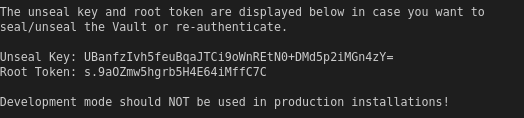

# Secrets example

This example demonstrates storing a secret to the secret store (Vault) and retrieving those secrets.

If in secure mode, the secrets are stored and retrieved from Vault based on the *SecretStoreExclusive* section of the configuration file.

Please refer to the [Application Functions SDK documentation](https://docs.edgexfoundry.org/1.2/microservices/application/AdvancedTopics/#secrets)  for more details on storing and getting secrets using the SDK.

## Run the app within EdgeX docker

**Steps:**

1. From the app-service-examples root folder, build the docker image for the secrets example service.

   ```
   make docker_secrets_example
   ```

2. Add the environment variable `ADD_SECRETSTORE_TOKENS` to the vault-worker service in your EdgeX docker compose file. It takes a list of service keys that it generates Vault tokens for. This is used as the base path for the service's secrets in Vault.  `secrets-example` is the application service that we will be running.

   ```yml
   environment:
         - "SECRETSTORE_SETUP_DONE_FLAG=/tmp/edgex/secrets/edgex-consul/.secretstore-setup-done"
         - "ADD_SECRETSTORE_TOKENS=secrets-example"
   ```

3. The default configuration is for running natively and we use environment overrides in the compose files for use in docker.

4. Add the secrets example application service to your EdgeX docker compose file. This includes the environment overrides for the SecretStore and SecretStoreExclusive configurations:

   ```yml
     app-service-secrets-example:
       image: edgexfoundry/docker-secrets-example:dev
       container_name: app-service-secrets-example
       hostname: app-service-secrets-example
       ports:
         - "48095:48095"
       networks:
         - edgex-network
       environment:
         <<: *common-variables
         SecretStore_Protocol: https
         SecretStore_TokenFile: /tmp/edgex/secrets/edgex-application-service/secrets-token.json
         SecretStoreExclusive_Host: edgex-vault
         SecretStoreExclusive_Protocol: https
         SecretStoreExclusive_RootCaCertPath: /tmp/edgex/secrets/ca/ca.pem
         SecretStoreExclusive_ServerName: edgex-vault
         SecretStoreExclusive_TokenFile: /tmp/edgex/secrets/secrets-example/secrets-token.json
       volumes:
         - /tmp/edgex/secrets/ca:/tmp/edgex/secrets/ca:ro,z
         - /tmp/edgex/secrets/edgex-application-service:/tmp/edgex/secrets/edgex-application-service:ro,z 
         - /tmp/edgex/secrets/secrets-example:/tmp/edgex/secrets/secrets-example:ro,z 
       depends_on:
         - vault-worker
         - data
   ```

5. Run EdgeX security services in docker to generate a Vault token for our app service:

   1. Run the secret store services in EdgeX using:

      `docker-compose -f <docker-compose file name> up -d vault-worker`

      Verify that the following services are running:
         - edgex-secrets-setup
         - edgex-vault
         - edgex-vault-worker
   2. Wait for about a minute to ensure tokens are created for the services that were specified in the docker compose section of vault-worker service for `ADD_SECRETSTORE_TOKENS` environment variable. Verify that the token `secrets-example` exist under `/tmp/edgex/secrets`.

5. Run the secrets example service:  
      ```
      docker-compose -f <docker-compose file name> up -d app-service-secrets-example
      ```

      Check the app's logs to make sure no errors occurred during startup:
   
      ```
      docker logs app-service-secrets-example
      ```
   
6. Follow the instructions in [Storing and Getting Secrets](#storing-and-getting-secrets) in order to test storing and retrieving secrets from the secret store.

## Run the app natively (for dev/debug)

The default configuration settings are used for running natively. The application service is already configured for running Vault in dev-mode (with http).  We need to run Vault, enable its secrets engine, then run our service. 

1. Run vault using the docker compose file in this directory. 

   `docker-compose -f docker-compose.yml up -d`

2. You will need to manually set the current Vault token in configuration.

   - Find the root token for Vault in the logs of the container:

     `docker logs <container-id>`

   

   - Copy the token to the *'root_token'* field in the token file (./res/*token.json*). Verify that `SecretStore.TokenFile` and  `SecretStoreExclusive.TokenFile` are already configured with ./res/*token.json* as the token file path.

3. Use docker exec to run commands on the running vault container instance.

   `docker exec -it <container_id> /bin/sh`

4. Enable the secrets engine using the Vault command line

   *Login into vault with the root token.*

   ```
   / # vault login
   / # vault secrets disable secret
   Success! Disabled the secrets engine (if it existed) at: secret/
   / # vault secrets enable -version=1 -path=secret kv
   Success! Enabled the kv secrets engine at: secret/
   ```

5. Run the secrets service: `go run main.go`
6. Follow the instructions in [Storing and Getting Secrets](#storing-and-getting-secrets) in order to test storing and retrieving secrets from the secret store.

## Storing and Getting Secrets

These tests use a collection of Postman requests, in *SecretsExample.postman_collection.json*, to store and retrieve secrets from the secret store.

1. Import the collection *SecretsExample.postman_collection.json* into Postman.

2. Execute the `Store Secrets` request in the Postman collection to push secrets to Vault. This is going through the App Service REST API, not directly to Vault. As such, the secret is exclusively for that app service instance.

3. Execute the `Get Secrets with App Service HTTP` request in the Postman collection.

   This request triggers an EdgeX event to the application service which causes execution of the pipeline function that calls the GetSecrets API.  As a result, the app service will get the exclusive secrets that were just pushed.

4. View the service's logs to verify that the secrets were retrieved. We'll view the secrets in the application's console (in production, NEVER log your application's secrets. This is done in the example service to demonstrate the functionality).

   1. Running in docker: `docker logs app-service-secrets-example`
   2. Running natively: view the console
