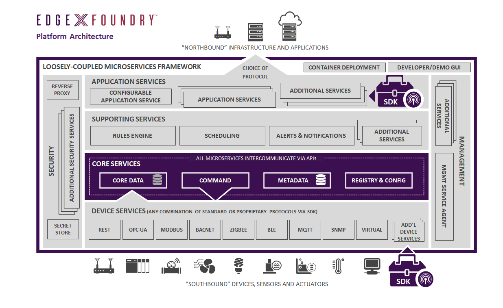

[To README](README.md)

# 3. How to install EdgeX 

The tools to run EdgeX services are ready. The EdgeX stack consists of many docker containers but users don't need to launch one by one since the EdgeX team offers Docker-compose files per each release iteration. 

<br/>

## 3.1 Launch EdgeX core services

The compose files can be found from a repository - [edgexfoundry/developer-scripts](https://github.com/edgexfoundry/developer-scripts). In this chapter, the Geneva version will be used as it is the latest stable version. To launch containers:
```sh
$ cd ~

# Let's store all repositories in a directory to organize the home directory.
$ mkdir repo
$ cd repo

# Clone the developer-scripts repository
$ git clone https://github.com/edgexfoundry/developer-scripts
$ cd developer-scripts/releases/geneva/compose-files
$ ls
README.md
docker-compose-geneva-redis-no-secty-arm64.yml
docker-compose-geneva-redis-no-secty.yml
docker-compose-geneva-redis-arm64.yml
docker-compose-geneva-redis.yml
docker-compose-geneva-mongo-no-secty-arm64.yml
docker-compose-geneva-mongo-no-secty.yml
docker-compose-geneva-mongo-arm64.yml
docker-compose-geneva-mongo.yml
docker-compose-geneva-ui-arm64.yml
docker-compose-geneva-ui.yml
docker-compose-portainer.yml

# There are several compose files but we only need one to launch for our purpose. 
# - ARM64 version should be used for RPI. 
# - Redis is the choice of DB because of MongoDB's license. 
# - Security is out of scope in this tutorial. 
# With these criteria, we will use "docker-compose-geneva-redis-no-secty-arm64.yml". 

# This command launches the stack but might take couple minutes depends on the network.
$ docker-compose -f docker-compose-geneva-redis-no-secty-arm64.yml up -d
...
Creating edgex-redis       ... done
Creating edgex-core-consul ... done
Creating edgex-support-scheduler     ... done
Creating edgex-support-notifications ... done
Creating edgex-core-metadata         ... done
Creating edgex-core-command                   ... done
Creating edgex-core-data             ... done
Creating edgex-app-service-configurable-rules ... done
Creating edgex-sys-mgmt-agent                 ... done
Creating edgex-kuiper                         ... done

# Once launching is done, let's check what are up and running. Some columns are removed.
$ docker ps | less -ESX
IMAGE                                                      STATUS       
emqx/kuiper:0.4.2-alpine                                   Up 11 seconds
edgexfoundry/docker-sys-mgmt-agent-go-arm64:1.2.1          Up 15 seconds
edgexfoundry/docker-app-service-configurable-arm64:1.2.0   Up 14 seconds
edgexfoundry/docker-core-command-go-arm64:1.2.1            Up 18 seconds
edgexfoundry/docker-core-data-go-arm64:1.2.1               Up 19 seconds
edgexfoundry/docker-core-metadata-go-arm64:1.2.1           Up 21 seconds
edgexfoundry/docker-support-scheduler-go-arm64:1.2.1       Up 23 seconds
edgexfoundry/docker-support-notifications-go-arm64:1.2.1   Up 22 seconds
arm64v8/redis:5.0.8-alpine                                 Up 26 seconds
edgexfoundry/docker-edgex-consul-arm64:1.2.0               Up 26 seconds
portainer/portainer
```

<br/>

The EdgeX structure diagram clearly shows the purpose of each service:



There are the core services in the middle. Devices services will talk to the hardwares. Supporting services will inject rules and run actions scheduled. Application services will interact with frontend or external cloud services. All the well designed services are just launched with the one line of command!

<br/>

## 3.2 Test EdgeX services with Curl 

Although the services are launched well, it is worth to test the servcies before writing any custom service.

Curl is a command line tool of *nix systems to transfer data to a given URL and the basic tool to ping EdgeX services:
```
$ curl http://localhost:48080/api/v1/ping
pong

$ curl http://localhost:48081/api/v1/ping
pong

$ curl http://localhost:48082/api/v1/ping 
pong
```

Also docker-compose can be used to monitor logs:
```sh
$ docker-compose -f docker-compose-geneva-redis-no-secty-arm64.yml logs -f {data|command|metadata}
```

<br/>

## 3.3 (Optional) Monitor EdgeX services with Portainer 

A local web service "Portainer" can be launched to monitor Docker services but it is not a command line tool so that let's use a web browser from the host machine. Before launch it, we need to edit a line in the compose file:
```sh
# Open and edit the "docker-compose-portainer.yml" 
# and update a line under the ports section from -"127.0.0.1:9000:9000" to - "9000:9000" to allow accesses from other machines.
$ vi docker-compose-portainer.yml

# Then launch it with this command.
$ docker-compose -f docker-compose-portainer.yml up -d
```

<br/>

Now we can access to the portainer web service with RPI's IP address and port number 9000 from the host's browser. For the first time access, a new password needs to be set. With the Portainer UI, we can monitor the log and interact with each service. 


<br/>

EdgeX stack is up and running so that we can start making our own custom device and app services. 

<br/>

---

Next: [How to develop custom device and app services](40_custom_services.md)
